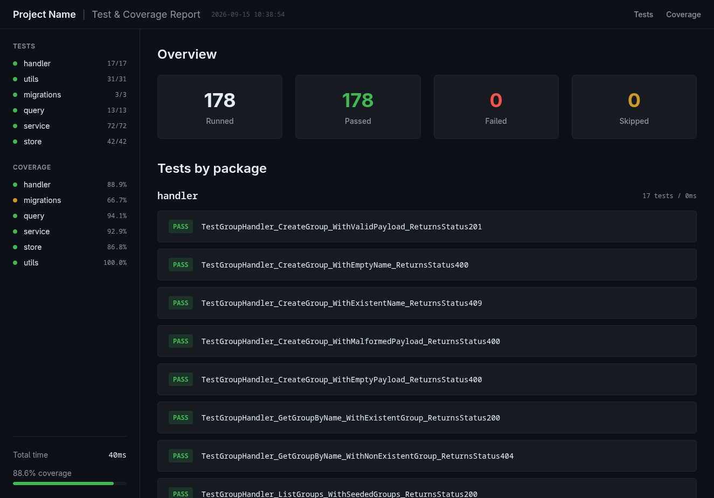
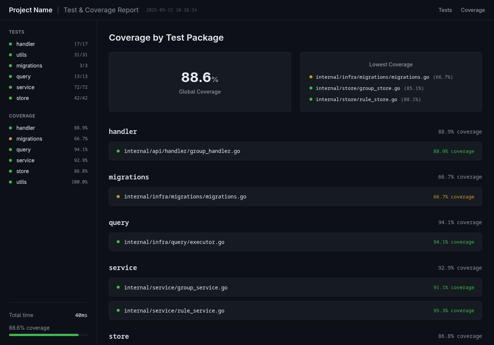

# test-prettify

`test-prettify` turns raw Go test output (`go test -json`) into clean, readable HTML reports. It parses NDJSON test events, aggregates metrics per package, and renders a visual dashboard of results.





## Features

- Reads test events from a JSON file or piped stdin
- Aggregates passed, failed, and skipped tests per package
- Parses Go coverage profiles (`coverage.out`) and maps block-level execution data onto source files
- Renders highlighted source code with exact block boundaries, including sub-line statements
- Generates a self-contained HTML report with overview and package details
- Configurable output directory

## Usage

Pipe from `go test`:

```sh
go test -json ./... | test-prettify
```

Or pass a file directly:

```sh
test-prettify test_results.json
```

Generate a coverage report by pointing at a profile produced with `go test -coverprofile`:

```sh
go test -coverprofile=coverage.out ./...
test-prettify test_results.json --coverage-profile coverage.out
```

Coverage profiles are resolved against the current module: `test-prettify` reads the `module` directive from `go.mod` and maps each profile path back to a local source file. In CI or monorepo setups, point the resolver elsewhere:

```sh
test-prettify test_results.json --coverage-profile coverage.out --coverage-root ./packages/api
```

By default, reports are written to `./reports/`. Specify a custom output directory with `--output-dir` (or `-o`):

```sh
go test -json ./... | test-prettify -o /path/to/output
```

```
Flags:
  -o, --output-dir string        Output directory for HTML reports (default "./reports/")
      --coverage-profile string  Path to a Go coverage profile (coverage.out)
      --coverage-root string     Module/source root used to resolve coverage files (default: current directory)
```

## Build

```sh
go build ./cmd/test-prettify
```

## How it works

1. **Parse** — `internal/parser` decodes the NDJSON stream of `go test -json` events into test results.
2. **Coverage** — `internal/coverage` parses `coverage.out`, resolves each file back to the local module, and maps raw block coordinates (`line.col,line.col`) onto highlighted source rows that preserve exact statement boundaries.
3. **Model** — `internal/model` and `internal/report` consolidate events into a `ReportData` source of truth with per-package summaries and coverage stats.
4. **Render** — `internal/templates` renders the report data into HTML pages in the output directory.

For a detailed step-by-step map of the coverage pipeline, see [docs/coverage-workflow.md](docs/coverage-workflow.md).

## Project layout

```
cmd/            CLI entrypoint
internal/
  cli/          Cobra command and flag handling
  parser/       NDJSON event parsing
  coverage/     Coverage profile parsing, path resolution and source highlighting
  model/        Report data structures
  report/       Aggregation logic
  templates/    HTML page rendering
docs/           Screenshots
```

## License

MIT — see [LICENSE](LICENSE).