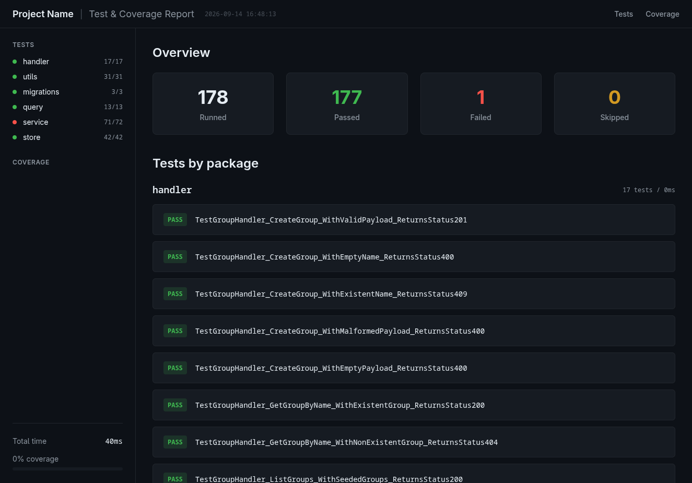

# test-prettify

`test-prettify` turns raw Go test output (`go test -json`) into clean, readable HTML reports. It parses NDJSON test events, aggregates metrics per package, and renders a visual dashboard of results.



## Features

- Reads test events from a JSON file or piped stdin
- Aggregates passed, failed, and skipped tests per package
- Generates a self-contained HTML report with overview and package details
- Configurable output directory

## Usage

Pipe from `go test`:

```sh
go test -json ./... | test-prettify
```

Or pass a file directly:

```sh
test-prettify test_results.json
```

By default, reports are written to `./reports/`. Specify a custom output directory with `--output-dir` (or `-o`):

```sh
go test -json ./... | test-prettify -o /path/to/output
```

```
Flags:
  -o, --output-dir string   Output directory for HTML reports (default "./reports/")
```

## Build

```sh
go build ./cmd/test-prettify
```

## How it works

1. **Parse** — `internal/parser` decodes the NDJSON stream of `go test -json` events into test results.
2. **Model** — `internal/model` and `internal/report` consolidate events into a `ReportData` source of truth with per-package summaries.
3. **Render** — `internal/templates` renders the report data into HTML pages in the output directory.

## Project layout

```
cmd/            CLI entrypoint
internal/
  cli/          Cobra command and flag handling
  parser/       NDJSON event parsing
  model/        Report data structures
  report/       Aggregation logic
  templates/    HTML page rendering
docs/           Screenshots
```

## License

MIT — see [LICENSE](LICENSE).